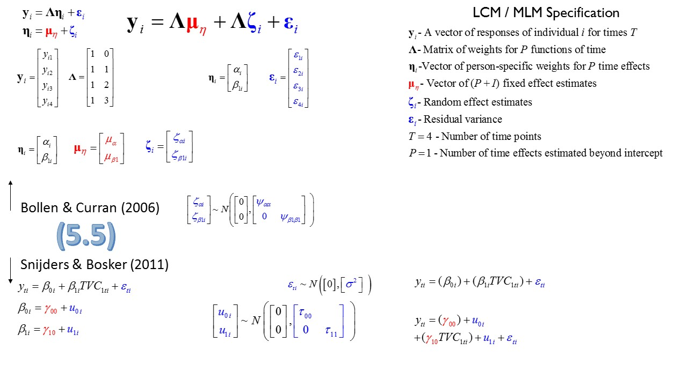

<!--  Set the working directory to the repository's base directory; this assumes the report is nested inside of only one directory.-->
```{r, echo=F, message=F} 
library(knitr)
opts_knit$set(root.dir='../../../')  #Don't combine this call with any other chunk -especially one that uses file paths.
```

<!-- Set the report-wide options, and point to the external script file. -->
```{r, echo=F, message=T}
require(knitr)
opts_chunk$set(
  results='show', 
  message = TRUE,
  comment = NA, 
  tidy = FALSE,
#   fig.height = 4.8, 
#   fig.width = 6.5, 
  out.width = NULL,
  fig.path = 'figure_rmd/',     
  dev = "png",
  dpi = 70
)
echoChunks <- FALSE
warningChunks<- FALSE
messageChunks<- FALSE
outwidthChunks <- "130%"
options(width=120) #So the output is 50% wider than the default.
read_chunk("./Chapters/05/R_Chapter5/ch5-ELSA.R") # the file to which knitr calls for the chunks
```


# Resources

#### General R


- [A GOOD PLACE TO START LEARNING R](http://www.rstudio.com/resources/training/online-learning/) - The RStudio team collects the best online resources.  

- [Swirl](http://swirlstats.com/students.html) and [DataCamp](https://www.datacamp.com/courses/introduction-to-r)  offer interactive courses.  

- for brief reviews of key books and resources see Will Beasley's [Resources Opinions](https://github.com/OuhscBbmc/RedcapExamplesAndPatterns/blob/master/DocumentationGlobal/ResourcesOpinions.md)  

 - another presentation by Will provides an excellent overview of [Statistical Collaboration with GitHub](http://htmlpreview.github.io/?https://raw.githubusercontent.com/OuhscBbmc/StatisticalComputing/master/2014_Presentations/05_May/BeasleyScugGitHub2014-05.html#/)
 - Winston Chan's [R Cookbook](http://shop.oreilly.com/product/9780596809164.do) is a perfect book to get you started with producing graphs with RStudio  
 - [Quick-R](http://www.statmethods.net/) Quick and convenient resource for R reference  
 - [60+ resources for learning R](http://www.computerworld.com/article/2497464/business-intelligence-60-r-resources-to-improve-your-data-skills.html) Will give you more than you can handle. Browse and see which resource fits your learning style and organizes information in the manner that makes sense to you.

#### Modeling

  - [stats::lm()](http://www.rdocumentation.org/packages/stats/functions/lm) function, see [Gelman & Hill](http://www.stat.columbia.edu/~gelman/arm/), pages 38-39       
  - [stats::glm()](http://www.rdocumentation.org/packages/stats/functions/glm) function     
  - [nlme::gls()](http://www.rdocumentation.org/packages/nlme/functions/gls) function    
  - see a basic example of model result processing in the slides on [Statistical Modeling](http://ialsa.github.io/COAG-colloquium-2014F/2014-11-18-Statistical-Modeling.html#35) of the COAG [Colloquium series](http://ialsa.github.io/COAG-colloquium-2014F) on reproducible research.  
  - [lme4::lmer](http://www.rdocumentation.org/packages/nlme/functions/gls) function,  see [Gelman & Hill](http://www.stat.columbia.edu/~gelman/arm/), pages 259-262 and Appendix C. 
  - [lmer guide](http://htmlpreview.github.io/?https://github.com/andkov/Longitudinal_Models_of_Religiosity_NLSY97/blob/master/Vignettes/lmer/for%20Appendix/lmerGuide.html#adding-model-output). Shows direct interaction with the model object, not through functions like Gelman & Hill show.

# Data prep

 Today we will look at the data example from chapter 5 of [Longitudinal Analysis](http://www.pilesofvariance.com/) by Lesa Hoffman. You will find all the necessary files at

```
 ./Chapters/05/R_Chapter5/
```
 after you [download and unzip](https://github.com/andkov/psy564/archive/master.zip) the folder of this repository.

```
 ./Chapters/05/R_Chapter5/hoffman-ch5.R
```
 contains code that conducts the analysis and 
   
```
 ./Chapters/03/R_Chapter3/hoffman-ch5.Rmd
```
contains the [report](https://github.com/andkov/psy564/blob/master/Chapters/03/R_Chapter3/hoffman-ch3.html). Html file must be compiled before it can be viewed. You can view .html files stored on GitHub.com by pasting their url address into [HTMLpreviewer](http://htmlpreview.github.io/?)

#### Working files
 - [hoffman-ch5.R](https://github.com/andkov/psy564/blob/master/Chapters/03/R_Chapter3/hoffman-ch3.R) contains the script that replicates **example 3a** from Chapter 3 of [Longitudinal Analysis](http://www.pilesofvariance.com/) by Lesa Hoffman. We fit empty between-person (3.1) and empty within-person (3.2) models to the supplied dataset containing 2 measures for 50 subjects.
 - [hoffman-ch5.Rmd](http://htmlpreview.github.io/?https://github.com/andkov/psy564/blob/master/Chapters/03/R_Chapter3/hoffman-ch3.html) contains annotations to what happens in <code>hoffman-ch5.R</code> script. HTML is "knitted" in RStudio by knitr package by combining .R and .Rmd files: explainations for computer and for humans, respectively.  This report is a self-contained account of two statistical models.  
 - [hoffman-ch5.html]() the webpage you are reading right now
 

## Data input

Before asking R to perform operations (functions), we load the packages which contain the definitions of these functions. 
```{r LoadPackages, warning=F,message=F}

```

We would like to import data the data file

```
SAS_Chapter5.sas7bdat
```

located at 

```
./Chapters/05/SAS_Chapter5/
```

of your repository. 

```{r LoadData}

```


## Data inspection

We'd like to inspect the data object we've just imported. Doulbe-click the icon of the dataset in the Environment tab of RStudio or use 
```
View(ds)
```
A few basic function calls give us a quick look ath the object *ds0* - our "ground zero" in the chain of data transformations
```{r BasicDescriptive}

```


## Wide to Long

Our data were in a long format, with each level of the variable *wave* recorded in a single column 
```{r}
head(ds0)
```

No other transformation is necessary. 
```{r StackData}

```
Suffix "L" in "dsL" signifies that the data is in the **L**ong format.

## Data tweaking

Data didn't require any tweaking.
```{r TweakLong}

```
Suffix "M" in "dsM" signifies that the data is ready for  **M**odeling

# Graphing

To better understand the patterns we visualize the data with a simple line plot
```{r GraphingData0}

```

To make the graph more readable and informative we customize it with a set of presets collected in a ggplot theme
```{r LoadGraphThemes}

```

and add customizations relevant to current scenario

```{r GraphingData1}

```

black lines give us a longitudinal perspective on the data, depicting the observed trajectories of individuals. To juxtapose is with cross-sectional perspective, we can add a different geom, styled to contrast the difference 

```{r GraphingData2}

```


# Modeling 

## 3.1
The baseline for the models to follow is the empty between-person model with no predictors


$\begin{array}{l}
{y_{ti}} = {\beta _{0i}} + {\varepsilon _{ti}}\\
{\beta _{0i}} = {\gamma _{00}}\\
{}\\
{y_{ti}} = {\gamma _{00}} + {\varepsilon _{ti}}
\end{array}$


### Run m3.1
```{r RunM3_1}

```

### Inspect m3.1
```{r InspectM3_1}

```

### Graph m3.1
```{r GraphM3_1, echo=echoChunks, warning=warningChunks, out.width=outwidthChunks}

```

### Full Spec m3.1


## 5.1 

Now we'd like to see how this basic model prediction will change when we compute a **U**nique intercept for each person

$\begin{array}{l}
{y_{ti}} = {\beta _{0i}} + {\varepsilon _{ti}}\\
{\beta _{0i}} = {\gamma _{00}} + {u_{0i}}\\
{}\\
{y_{ti}} = ({\gamma _{00}} + {u_{0i}}) + {\varepsilon _{ti}}
\end{array}$

### Run m5.1
```{r RunM5_1}

```

### Inspect m5.1
```{r InspectM5_1}

```

### Graph m5.1
```{r GraphM5_1, echo=echoChunks, warning=warningChunks, out.width=outwidthChunks}

```

### Full Spec m5.1


## 5.3

The first predictor we will enter into our model is the fixed effect of linear time

$\begin{array}{l}
{y_{ti}} = {\beta _{0i}} + {\beta _{1i}}TV{C_{1ti}} + {\varepsilon _{ti}}\\
{\beta _{0i}} = {\gamma _{00}} + {u_{0i}}\\
{\beta _{1i}} = {\gamma _{10}}\\
{}\\
{y_{ti}} = ({\gamma _{00}} + {u_{0i}}) + {\gamma _{10}}(TV{C_{1ti}}) + {\varepsilon _{ti}}
\end{array}$


### Run m5.3
```{r RunM5_3}

```

### Inspect m5.3
```{r InspectM5_3}

```

### Graph m5.3
```{r GraphM5_3, echo=echoChunks, warning=warningChunks, out.width=outwidthChunks}

```

### Full Spec m5.3


## 5.5

Now would like to compute a unique linear slope for each individual

$\begin{array}{l}
{y_{ti}} = {\beta _{0i}} + {\beta _{1i}}TV{C_{1ti}} + {\varepsilon _{ti}}\\
{\beta _{0i}} = {\gamma _{00}} + {u_{0i}}\\
{\beta _{1i}} = {\gamma _{10}} + {u_{1i}}\\
{}\\
{y_{ti}} = ({\gamma _{00}} + {u_{0i}}) + ({\gamma _{10}} + {u_{1i}})(TV{C_{1ti}}) + {\varepsilon _{ti}}
\end{array}$

### Run m5.5
```{r RunM5_5}

```

### Inspect m5.5
```{r InspectM5_5}

```

### Graph m5.5
```{r GraphM5_5, echo=echoChunks, warning=warningChunks, out.width=outwidthChunks}

```

### Full Spec m5.5


</br> </br> </br> </br> </br> </br> </br> </br> </br> </br> </br> </br> </br> </br> </br> </br> </br> </br> </br> </br> </br>


  

  
 
